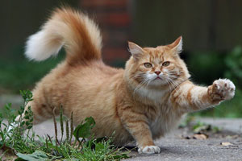

<title>Прокат котиков</title>
<head>

</head>

<h1>Как выбрать своего котика?</h1>

Котики бывают разные. Это знают все. Но подобрать котика не так-то просто. Представляем вам первый котоподбиратель! И да коснется вас пушистая лапка!

Краткое содержание:

<b><a href="#1">1. Типы котиков</a></b>

<b><a href="#2">2. Стоимость услуг</a></b>

<b><a href="#3">3. Полезные советы</a></b>

<h2>Типы котиков</h2>

Совместно с ООО "Любители котиков" мы создали первый прокат котиков. А разобраться, какой котик тебе подойдет поможет наша краткая инструкция, созданная при участии лучших знатоков котиков.

При подготовки данного списка типов мы ориентировались на основные потребности пользователей котиков. Нами было опрошено 100 тыс. счастливых владельцев котов и кошек. И еще столько же тех, кто только мечтает о котике.

<h3>Лысые котики</h3>
<h4>Подойдут пользователям котиков, которых достало убирать шерсть</h4>

 

 Да, бывает и такое: приходишь с работы, а кошачья шерсть повсюду. Или нет: собираешься на работу, а на новых черных брюках - шерсть от любимой Мурки.

 Что делать? Завести лысого кота. Они веселые, жизнерадостные и общительные. Проблема одна - мерзнут. Поэтому лучше сделать для своего кота платье. Из старого носка, например.
 

<h3>Очень пушистые котики</h3>
<h4>Подойдут пользователям котиков, которые хотят потискать кота</h4>
 

Пушистый котик - это самое лучшее, что может быть с каждым. Зимой он согреет, а летом... Летом не согреет. Но что поделать, ведь он такой пушистый. 

У пушистого кота масса плюсов: например, его можно вычесывать и вязать носки. Или можно подсунуть другу-аллергику. 

<h3>Хулиганистые котики</h3>
<h4>Подойдут пользователям котиков, которым все время скучно</h4>
 

С хулиганистыми котиками не соскучишься. Проснулся утром - а на кухне такой беспорядок, что нет смысла убираться. Ну и правильно - зачем? Лучше котика погладить!

Коты-хулиганы любого избавят от депрессии и лишних вещей!

<h3>Независимые котики</h3>
<h4>Подойдут пользователям котиков, которые не любят серьезные отношения</h4>
 

Такой котик приходит домой, когда захочет и уходит когда надо. Вам остается только ждать и надеяться. Зато каждая новая встреча - всегда радость.

 Независимый котик - это как московское лето. Он вроде есть, а надел шорты - уже и нет!

<h3>Спортивные котики</h3>
<h4>Подойдут пользователям котиков, которые считают, что они офигеть какие спортсмены</h4>
 

Бегаете по утрам? Планируете бегать по утрам? Тогда ваш выбор - спортивный котик. Спортивный котик играет в прятки, бегает на перегонки и феерично взбирается по шторам.

Спортивный котик такой спортивный, что даже если вы не спортивный, то вам станет стыдно и вы купите хотя бы эспандер.

<h3>Уютные котики</h3>
<h4>Подойдут пользователям котиков, которые хотят купить камин</h4>
 

Уютные котики умеют везде создать уют. Даже если у вас на полу валяются несколько носков, которым суждено никогда не найти пару, уютные котики сделают так, что ваши гости не заметят носки. 

Эти котики лучше всех мурлыкают и умильнее всех лакают молоко. Прелесть, а не котики!

<h2>Стоимость услуг</h2>

Стоимость услуг рассчитывается, исходя из нескольких факторов

 1. Был ли у потенциального пользователя котик или брал ли он котика на прокат

 2. Насколько подробно заполнена анкета пользователя (нахождение дома, умение играть с котиками, зарплата и трафт на корм)

 3. Нет ли у пользователя маленьких детей и других котиков

Средняя стоимость проката котика составляет <strong>100 рублей</strong> в час. 

За более подробной информацией обращайтесь по адресу: <address>Москва, ул. Муркина, д.3</address>

<h2>Полезные советы</h2>

<h3>Найдите место</h3>

Пусть даже прокатный котик будет иметь свое место.Это может быть старое кресло или наоборот - модный пуфик.
<h3>Купите еды</h3>

Заранее узнайте, что любит ваш питомец и запаситесь вкунсым кормом.
<h3>Купите игрушки</h3>

Бантик, мышка, пищалка - подойдет все. Максимально обустройте место, где будет жить ваш питомец.
<h3>Подготовьте к транспортировке</h3>

Подумайте о том, как нести вашего питомца домой. Перенос в рюкзаке для котика - это сресс. 
Мы рекомендуем переноску, которую можно взять напрокат в нашем центре.

<!-- Yandex.Metrika counter -->  <noscript>

</noscript> <!-- /Yandex.Metrika counter -->

